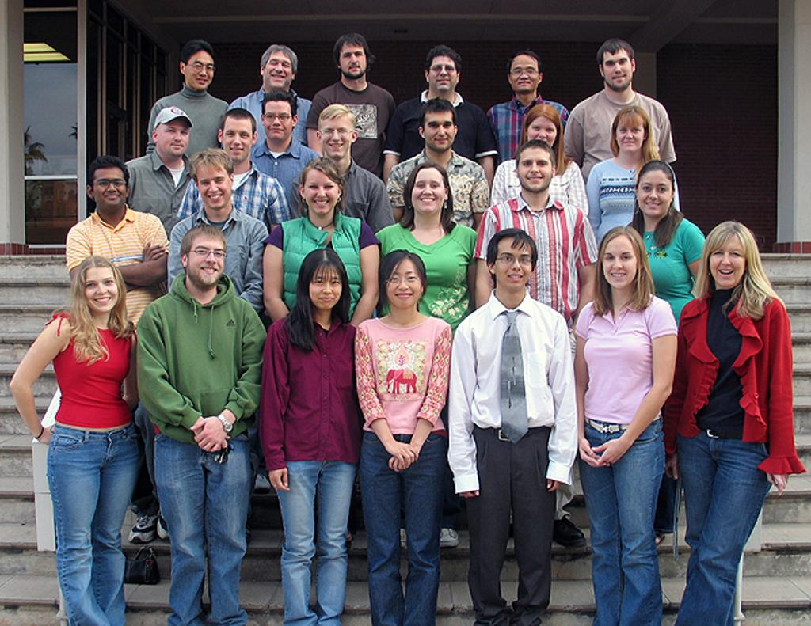
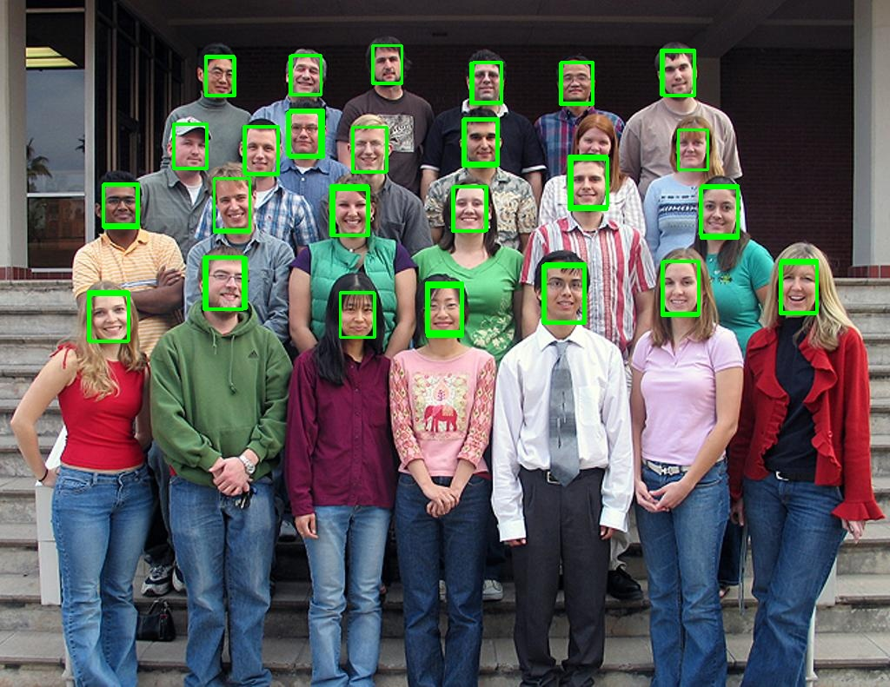

# ultra-lightweight-face-detection-rfb-320

## 概述

ultra-lightweight-face-detection-rfb-320 是基于 RFB（Receptive Field Block）的超轻量级人脸检测模型，源自开源项目 [Ultra-Light-Fast-Generic-Face-Detector-1MB](https://github.com/Linzaer/Ultra-Light-Fast-Generic-Face-Detector-1MB)。模型仅 0.3004 MParams、0.2106 GFLOPs，最初即为 ARM 等低算力边缘设备设计，可在鲲鹏服务器 CPU 上以极低开销完成图像中的人脸检测，适用于媒体推理、人脸识别前置检测等场景。

原始模型为 PyTorch 训练并导出的 ONNX 模型。本示例通过 OpenVINO Python API（`ov.convert_model()`）在内存中完成 ONNX → OpenVINO 模型转换，编译到 CPU 设备执行推理，输出人脸检测框及置信度。

## 模型规格

| Metric           | Value    |
|------------------|----------|
| Source framework | PyTorch* |
| GFlops           | 0.2106   |
| MParams          | 0.3004   |
| Input size       | 240×320  |

### 模型输入

模型接收单张待检测的图像（Image），具体规格如下：

| 属性 | 值 |
|------|------|
| 输入名称 | `input` |
| 输入类型 | Image（待检测图像） |
| Shape | `1, 3, 240, 320` |
| 数据布局 | `B, C, H, W`（NCHW） |
| 数据类型 | `float32` |
| 取值范围 | 约 `[-1.0, 1.0]`（归一化后） |
| 颜色顺序 | `BGR` |

送入模型前需将原图 resize 到 320×240（宽×高），模型在 320×240 分辨率上做密集 anchor 检测。

原始 ONNX 模型输入为 RGB，但转换后的 OpenVINO 模型输入为 BGR。由于 `cv2.imread()` 读取的图像默认即为 BGR 顺序，因此可直接使用，无需额外通道转换。

预处理：`(pixel - 127) / 128`，即 mean = `[127, 127, 127]`、scale = `[128, 128, 128]`。

### 模型输出

模型输出两个张量：

- `boxes`，shape：`1, 4420, 4` —— 检测框坐标 `[x_min, y_min, x_max, y_max]`，归一化到 `[0, 1]`，需按原图宽高映射回像素坐标。
-  `scores`，shape：`1, 4420, 2` —— 各 anchor 的得分，取 `scores[0, i, 1]` 作为人脸置信度。

其中 4420 为检测 anchor 数量。

后处理流程：

```text
4420 组 boxes + scores
    ↓
confidence > 0.5 过滤
    ↓
坐标映射回原图
    ↓
（可选）NMS 去除重叠框
    ↓
最终人脸检测框
```

## 运行示例

### 前置条件

已按 [安装指南](../../docs/zh/installation_guide.md) 完成 OpenVINO 环境部署，并按 [快速入门](../../README.md) 下载模型与测试图片：

```bash
omz_downloader --name ultra-lightweight-face-detection-rfb-320

wget -O /path/to/face_test.jpg \
    "https://raw.githubusercontent.com/Linzaer/Ultra-Light-Fast-Generic-Face-Detector-1MB/master/imgs/11.jpg"
```

### 运行命令

```bash
# 使用默认路径
python3 test_face_detection_FRB320.py

# 自定义模型、图像与设备
python3 test_face_detection_FRB320.py \
    --onnx /path/to/ultra-lightweight-face-detection-rfb-320.onnx \
    --image /path/to/face_test.jpg \
    --output face_result.jpg \
    --device CPU \
    --confidence 0.5 \
    --precision f16
```

### 参数说明

| 参数           | 默认值                          | 说明                                   |
|----------------|--------------------------------|----------------------------------------|
| `--onnx`       | Open Model Zoo `public/` 下路径 | ONNX 模型路径                           |
| `--image`      | 内置测试图路径                  | 输入图像路径                            |
| `--output`     | `face_result.jpg`              | 输出图像路径                            |
| `--device`     | `CPU`                          | 推理设备                                |
| `--confidence` | `0.5`                          | 置信度阈值                              |
| `--precision`  | `f16`                          | 推理精度提示，可选 `f16` / `f32`        |


### 示例结果

以下为使用默认测试图片 `face_test.jpg` 运行本示例的检测效果。模型成功定位图像中的人脸位置，并以绿色矩形框标注，检测结果保存至 `face_result.jpg`。

**输入图像**：



**检测结果**（绿色框为模型输出的人脸检测框）：



### benchmark_app 性能测试

```bash
/workspace/openvino/bin/aarch64/Release/benchmark_app \
    -m /path/to/ultra-lightweight-face-detection-rfb-320.xml \
    -d CPU \
    -hint latency \
    -i /path/to/face_test.jpg
```

## 合规信息

原始模型来自 [Ultra-Light-Fast-Generic-Face-Detector-1MB](https://github.com/Linzaer/Ultra-Light-Fast-Generic-Face-Detector-1MB)，遵循 MIT License。

[*] 其他名称和品牌可能是其各自所有者的财产。
